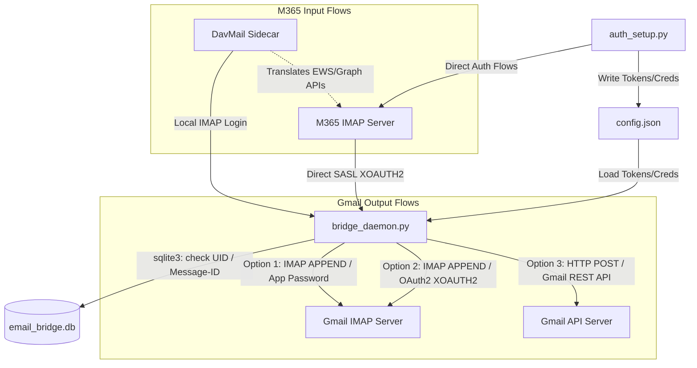

# Microsoft 365 to Gmail Email Bridge Daemon

A lightweight Python service that synchronizes emails from a Microsoft 365 inbox to a Gmail account. It uses the Microsoft Authorization Code Flow by default (via Microsoft Office's approved first-party Client ID) for Outlook, with Device Code Flow available as a fallback, and supports either standard App Passwords or Google OAuth2 (Device Flow) for Gmail.

---

## ⚡ Quick Setup (M365 & gmail.com using App Passwords)

Follow these steps to set up synchronization from your **Microsoft 365** account to a generic **gmail.com** account in less than 5 minutes:

### 1. Generate a Gmail App Password
1. Go to your **Google Account Settings** -> **Security**.
2. Under "How you sign in to Google", ensure **2-Step Verification** is turned on.
3. Click on **2-Step Verification**, scroll to the bottom, and select **App passwords**.
4. Generate a new app password (e.g. name it `Email Bridge`). Copy the **16-character code** (no spaces).

### 2. Run the Configuration Utility
Run the interactive setup script:
```bash
python auth_setup.py
```
*   Select option **`[1] Setup / Reconfigure`**.
*   Enter your **Microsoft 365 email** and **Gmail email**.
*   Select Gmail authentication method **`[1] App Password`** and paste the **16-character code** you generated.
*   The script will print a URL for Microsoft authentication.
*   Open the URL in your browser, sign in with your M365 account, and after a successful login you will be redirected to a blank page.
*   Copy the entire URL from the address bar and paste it back into the terminal to complete authorization.

### 3. Run the Sync Daemon
```bash
python bridge_daemon.py
```
*The daemon is now running in the background, copying new emails from Microsoft 365 to Gmail every 5 minutes.*

---

## Architecture Overview



---

## Features

- **Flexible M365 Connections**:
  - **Direct OAuth2**: Authenticate directly with M365 via Authorization Code Flow or Device Code Flow.
  - **DavMail Sidecar**: Connect via a local DavMail IMAP proxy (ideal for organizations with strict enterprise conditional access or managed DavMail gateways).
- **Flexible Gmail Authentications**:
  - **App Password (Default)**: Connects using your username and App Password.
  - **Google OAuth2 (REST API)**: Connects via Google's `users.messages.insert` API endpoint using Browser Copy-Paste Flow (recommended) or Device Code Flow to obtain OAuth2 tokens.
  - **Google OAuth2 (IMAP XOAUTH2)**: Connects to Gmail IMAP server using SASL XOAUTH2.
- **Robust State Tracking**: Leverages a local SQLite database to track processed UIDs and `Message-ID` headers, completely avoiding duplicate delivery to Gmail.
- **Dual Runtime Modes**: Run either as a one-shot task (ideal for `cron` scheduler) or as an active background loop daemon.
- **Zero Third-Party Runtime Dependencies**: The daemon runs entirely using Python's standard library. Only `pytest` is required for testing.

---

## Prerequisites

- **Python 3.8+**
- **Option 1 (App Password Setup)**:
  - Enable 2-Step Verification on your Gmail account.
  - Go to Google Account Settings -> Security -> App passwords.
  - Generate a new app password and copy the 16-character code.
- **Option 2 & 3 (Google OAuth2 Setup)**:
  - A Google Cloud Platform (GCP) project with the **Gmail API** enabled.
  - An OAuth consent screen configured in GCP (typically set to "External" or "Internal", in "Testing" status).
  - A **Desktop Application** OAuth client credential, providing a Client ID and Client Secret.
  - Your Gmail address added as a Test User on the OAuth consent screen.

---

## Setup & Configuration (Complete Menu Options)

The bridge features a comprehensive administration utility:
```bash
python auth_setup.py
```
This utility provides an interactive menu:

*   **`[1] Setup / Reconfigure Email Bridge`**: Creates or updates configuration, prompts for credentials, and runs Microsoft (Authorization Code or Device Code Flow) and Google Device Code Flow authentications.
*   **`[2] Tear Down / Reset`**: Prompts for confirmation and deletes the local configuration file (`config.json`) and the SQLite tracking databases (`email_bridge.db*`), fully clearing the local footprint.

---

## Running the Daemon

### Option A: Running as a Background Daemon Loop
The daemon runs continuously, checking for new emails every 5 minutes (300 seconds) by default.
```bash
python bridge_daemon.py
```
You can customize the sync interval or config file using flags:
```bash
python bridge_daemon.py --interval 60 --config my_config.json
```

### Option B: Running as a Cron Job (One-Shot)
To run synchronization as a one-off task (perfect for orchestrating via `cron`), use the `--one-shot` flag:
```bash
python bridge_daemon.py --one-shot
```

##### Example Cron Configuration (Every 15 minutes)
```cron
*/15 * * * * /usr/bin/python3 /path/to/bridge_daemon.py --one-shot --config /path/to/config.json >> /var/log/email_bridge.log 2>&1
```

---

## Testing

### Running Tests Locally
Ensure you have `pytest` installed, then run:
```bash
pytest -v
```

### Running Tests in Docker (Recommended)
You can run the tests in an isolated Docker container with docker-compose:
```bash
docker-compose run test-suite
```

---

## Database Schema Details

The SQLite database tracks synchronized emails under the `processed_emails` table:

- `m365_email`: M365 account source email.
- `uid_validity`: Server-side IMAP folder UID validity tracker.
- `uid`: Unique identifier of the message inside the folder.
- `message_id`: Global RFC822 `Message-ID` header.
- `processed_at`: Datetime when the message was successfully copied.

> [!NOTE]
> Even if the mail server resets its UID numbers (triggering a change in `uid_validity`), the bridge remains duplicate-free by verifying the `Message-ID` header as a secondary safety guard.

---

## 🚀 Setup with DavMail Sidecar Proxy (O365)

If your organization has authorized/requires the use of DavMail, you can run it as a local sidecar service. DavMail acts as a secure translator, converting local standard IMAP login requests into Microsoft Graph or Exchange Web Services (EWS) API calls using modern OAuth2 authentication.

### 1. Configure DavMail
We provide a pre-configured template `davmail.properties` in the root of the repository.
* The default authentication mode is `O365DeviceCode`, which is headless-friendly.
* When DavMail starts or requires authentication, it prints the Microsoft device login link and code to the container logs.

### 2. Start the Sidecar Service
Bring up the DavMail sidecar using Docker Compose:
```bash
docker-compose up -d davmail
```

### 3. Authenticate with DavMail
Check the container logs to find the device authentication message:
```bash
docker logs davmail
```
Look for a line like:
```text
To sign in, use a web browser to open the page https://microsoft.com/devicelogin and enter the code C8H2J8K9L to authenticate.
```
Open the link, input the code, and authenticate with your M365 credentials. Once complete, DavMail automatically caches the OAuth2 refresh tokens back into the local `davmail.properties` file.

### 4. Configure the Email Bridge
Run the configuration utility:
```bash
python auth_setup.py
```
* Under M365 connection method, select **`[2] DavMail Sidecar Proxy`**.
* Enter `davmail` (if running inside Docker) or `localhost` (if running daemon locally) as the IMAP server.
* Use `1143` as the IMAP port and select `n` for SSL (connections inside the local Docker network are unencrypted; DavMail connects to Microsoft securely using HTTPS).
* Enter the password that decrypts the DavMail modern token store.

---

## Future Direction: Gmail-to-M365 Synchronization (Reverse Sync)

To reverse the direction of synchronization (from Gmail to Microsoft 365), the following changes would be required:

1. **Authentication Expansion**:
   - The Microsoft 365 connection would still use `auth_setup.py` (Authorization Code Flow) but we would need the IMAP folder write permission scope: `https://outlook.office.com/IMAP.AccessAsUser.All`. (This is already included in our current scope).
   - Gmail IMAP login would read emails instead of appending. Since Gmail is the source, standard IMAP `uid search` and header parsing would be performed on the Gmail IMAP connection.
2. **Synchronizing Engine Modifications**:
   - Read from Gmail's `INBOX`.
   - SQLite DB would track processed Gmail IMAP UIDs and `Message-ID`s instead of M365 UIDs.
   - Use M365 IMAP `append` to write messages into Outlook's `INBOX` or other folders.
3. **Draft Folder Support**:
   - If copying drafts, we would handle the `\Draft` flag and sync specific folders like `[Gmail]/Drafts` to Microsoft 365's `Drafts`.
