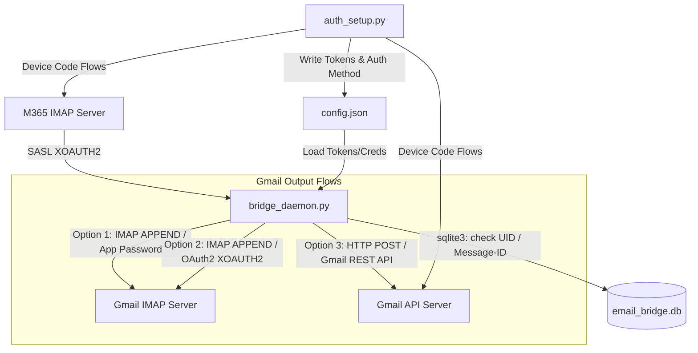

# Microsoft 365 to Gmail Email Bridge Daemon

A lightweight Python service that synchronizes emails from a Microsoft 365 inbox to a Gmail account. It uses the Microsoft Device Code Flow (via Alpine's registered Client ID) for Outlook, and supports either standard App Passwords or Google OAuth2 (Device Flow) for Gmail.

---

## Architecture Overview



---

## Features

- **Flexible Gmail Authentications**:
  - **App Password (Default)**: Connects using your username and App Password.
  - **Google OAuth2 (REST API)**: Connects via Google's `users.messages.insert` API endpoint using short-lived OAuth2 access tokens and a base64url payload. Highly recommended for workspace users.
  - **Google OAuth2 (IMAP XOAUTH2)**: Connects to Gmail IMAP server using SASL XOAUTH2.
- **Device Code Flow Authentication**: Authenticate securely to M365 and Google without custom web redirects.
- **Robust State Tracking**: Leverages a local SQLite database to track processed UIDs and `Message-ID` headers, completely avoiding duplicate delivery to Gmail.
- **Dual Runtime Modes**: Run either as a one-shot task (ideal for `cron` scheduler) or as an active background loop daemon.
- **Zero Third-Party Runtime Dependencies**: The daemon runs entirely using Python's standard library. Only `pytest` is required for testing.

---

## Prerequisites

- **Python 3.8+**
- **Option 1 (App Password Setup)**:
  - Enable 2-Step Verification on your Gmail account.
  - Go to Google Account Settings -> Security -> App passwords.
  - Generate a new app password (e.g. name it "Email Bridge") and copy the 16-character code.
- **Option 2 & 3 (Google OAuth2 Setup)**:
  - A Google Cloud Platform (GCP) project with the **Gmail API** enabled.
  - An OAuth consent screen configured in GCP (typically set to "External" or "Internal", in "Testing" status).
  - A **Desktop Application** OAuth client credential, providing a Client ID and Client Secret.
  - Your Gmail address added as a Test User on the OAuth consent screen.

---

## Setup & Configuration

### 1. Installation
Clone the repository and install the development dependencies:
```bash
pip install -r requirements.txt
```

### 2. Run the Configuration Utility
Run the setup utility to configure the email bridge:
```bash
python auth_setup.py
```

The script will guide you through:
1. Entering your Microsoft 365 and Gmail email addresses.
2. Selecting your Gmail Authentication method:
   - `[1] App Password`: Enter your 16-character Gmail App Password.
   - `[2] Google OAuth2 REST API`: Enter your Google Client ID/Secret, then complete the Google Device Login flow.
   - `[3] Google OAuth2 IMAP XOAUTH2`: Enter your Google Client ID/Secret, then complete the Google Device Login flow.
3. Authenticating with Microsoft 365 using the Microsoft Device Login flow.

Upon completion, all tokens and configurations will be stored securely in `config.json`.

---

## Running the Daemon

### Option A: Running as a Background Daemon Loop
The daemon runs continuously, checking for new emails every 5 minutes (300 seconds) by default.
```bash
python bridge_daemon.py
```
You can customize the sync interval or config file using flags:
```bash
python bridge_daemon.py --interval 60 --config my_config.json
```

### Option B: Running as a Cron Job (One-Shot)
To run synchronization as a one-off task (perfect for orchestrating via `cron`), use the `--one-shot` flag:
```bash
python bridge_daemon.py --one-shot
```

##### Example Cron Configuration (Every 15 minutes)
```cron
*/15 * * * * /usr/bin/python3 /path/to/bridge_daemon.py --one-shot --config /path/to/config.json >> /var/log/email_bridge.log 2>&1
```

---

## Testing

### Running Tests Locally
Ensure you have `pytest` installed, then run:
```bash
pytest -v
```

### Running Tests in Docker (Recommended)
You can run the tests in an isolated Docker container with docker-compose:
```bash
docker-compose run test-suite
```

---

## Database Schema Details

The SQLite database tracks synchronized emails under the `processed_emails` table:

- `m365_email`: M365 account source email.
- `uid_validity`: Server-side IMAP folder UID validity tracker.
- `uid`: Unique identifier of the message inside the folder.
- `message_id`: Global RFC822 `Message-ID` header.
- `processed_at`: Datetime when the message was successfully copied.

> [!NOTE]
> Even if the mail server resets its UID numbers (triggering a change in `uid_validity`), the bridge remains duplicate-free by verifying the `Message-ID` header as a secondary safety guard.

---

## Future Direction: Gmail-to-M365 Synchronization (Reverse Sync)

To reverse the direction of synchronization (from Gmail to Microsoft 365), the following changes would be required:

1. **Authentication Expansion**:
   - The Microsoft 365 connection would still use `auth_setup.py` (Device Code Flow) but we would need the IMAP folder write permission scope: `https://outlook.office.com/IMAP.AccessAsUser.All`. (This is already included in our current scope).
   - Gmail IMAP login would read emails instead of appending. Since Gmail is the source, standard IMAP `uid search` and header parsing would be performed on the Gmail IMAP connection.
2. **Synchronizing Engine Modifications**:
   - Read from Gmail's `INBOX`.
   - SQLite DB would track processed Gmail IMAP UIDs and `Message-ID`s instead of M365 UIDs.
   - Use M365 IMAP `append` to write messages into Outlook's `INBOX` or other folders.
3. **Draft Folder Support**:
   - If copying drafts, we would handle the `\Draft` flag and sync specific folders like `[Gmail]/Drafts` to Microsoft 365's `Drafts`.
